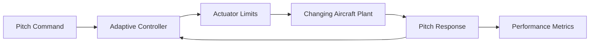

# Adaptive Flight Control Testbed

Synthetic flight-control laboratory that compares a fixed-gain controller with a lightweight adaptive controller as vehicle response changes during flight.

## Capabilities

- Second-order pitch-axis aircraft surrogate
- Command tracking with actuator saturation
- Online gain adaptation based on tracking error
- Scheduled plant degradation event
- Settling-time, overshoot, RMS-error, and control-effort metrics
- CSV traces, JSON report, tests, and CI



## Run

```bash
python testbed.py --mode adaptive --duration 25 --output artifacts
python testbed.py --mode fixed --duration 25 --output artifacts-fixed
python -m unittest discover -s tests -v
```

At 12 seconds the synthetic plant loses control effectiveness. The adaptive mode adjusts its proportional gain within conservative bounds and records the resulting performance.

## Disclaimer

Educational generic control-system model only; not flight-qualified and not representative of any real defense platform.