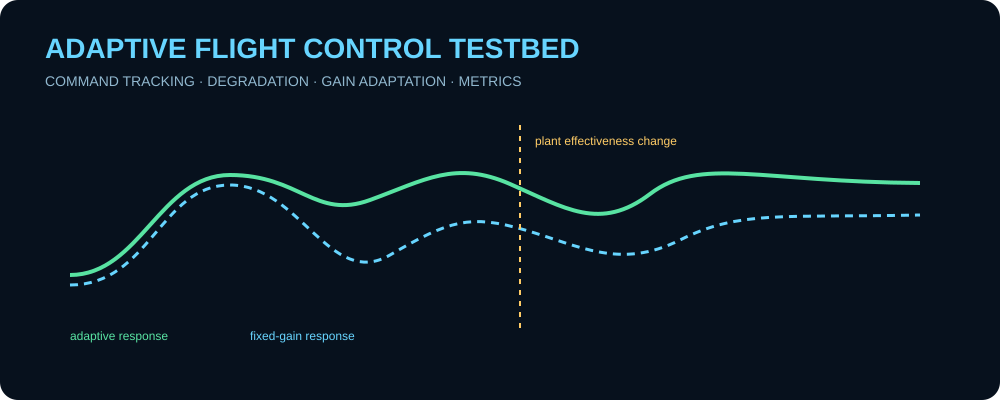
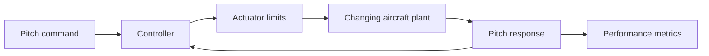

# Adaptive Flight Control Testbed

  

A runnable synthetic flight-control laboratory that compares a **fixed-gain controller** with a lightweight **adaptive controller** as a generic aircraft plant changes during flight. The project is designed as a transparent controls/V&V study rather than a black-box autopilot.

> Educational generic control-system model only. It is not flight-qualified and does not represent a real defense platform.

<p align="center"></p>

## Capabilities

- second-order pitch-axis aircraft surrogate
- commanded pitch tracking
- actuator saturation
- fixed-gain and adaptive control modes
- online proportional-gain adjustment using tracking error
- scheduled loss of synthetic control effectiveness
- settling-time, overshoot, RMS-error, and control-effort metrics
- CSV time histories and JSON performance reports
- deterministic automated tests and GitHub Actions CI

## Architecture



## Quick start

```bash
git clone https://github.com/skytruong90/Adaptive-Flight-Control-Testbed.git
cd Adaptive-Flight-Control-Testbed
python testbed.py --mode adaptive --duration 25 --output artifacts
python testbed.py --mode fixed --duration 25 --output artifacts-fixed
```

Run the tests:

```bash
python -m unittest discover -s tests -v
```

## Experiment design

At 12 seconds the synthetic plant loses a portion of its control effectiveness. The fixed controller keeps its original gain. The adaptive controller adjusts its proportional gain inside conservative bounds based on accumulated tracking error. Both cases use the same command profile and plant transition so their metrics are directly comparable.

## Outputs

Each run writes a CSV trace containing time, command, response, controller gain, control effort, and plant effectiveness. A JSON report summarizes RMS error, overshoot, settling behavior, peak effort, and terminal state.

This makes the project useful both interactively and in automated regression pipelines.

## Validation strategy

Automated tests verify deterministic behavior, actuator saturation, bounded adaptive gains, the scheduled plant transition, and report generation. CI executes the test suite plus a short smoke simulation.

## What I learned / demonstrated

- how plant-model mismatch changes closed-loop tracking performance
- why adaptation needs explicit gain limits and should not be allowed to grow without bound
- how to compare controllers fairly using identical commands and disturbances
- how RMS error, overshoot, settling time, and control effort expose different performance tradeoffs
- how to turn a controls experiment into reproducible test evidence rather than a one-off plot

## Limitations

The plant is a low-order single-axis surrogate. The project does not include full 6-DOF aerodynamics, flexible modes, actuator dynamics, sensor noise, robustness proofs, gain/phase margins, certification analysis, or hardware interfaces.

## Disclaimer

All parameters and degradation events are synthetic and public-safe.